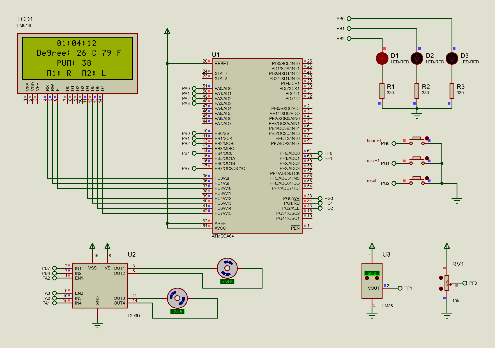

# Microprocessor Lab Final Project
In this project, we were asked to fulfill four criteria:
- LEDs blink at different rates: 1s, 500ms and 200ms, respectively.
- The LCD shows time in its first row. In addition, three buttons are considered to increase hour, minute and reset the timer.
- The LCD shows the temperature in both celsius and fahrenheit in its second row.
- The two DC motors are controlled using PWM. The duty cycle is displayed in the third row and in the last row, the directions of each of these motors are shown.

The program has been written for ATMega64 microcontroller using CodeVisionAVR in C language. Moreover, the simulation file is included and be run using Proteus.

## Simulation Schematic

